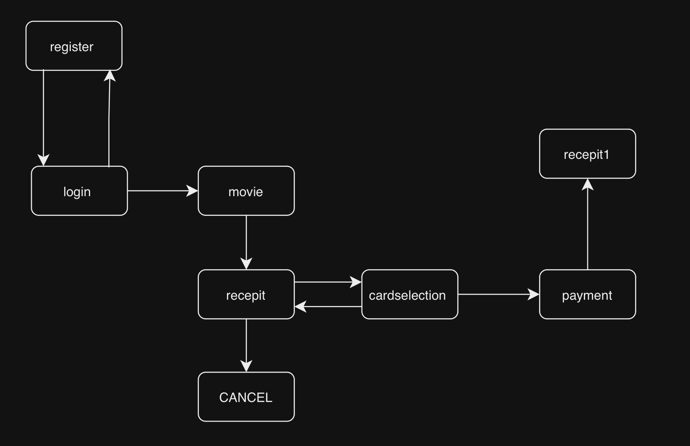

# Movie Ticket Booking System

## Overview
The Movie Ticket Booking System is designed to streamline the process of booking movie tickets online. Users can log in, select their preferred movie, theater, showtime, and the number of tickets. After finalizing the booking, they can proceed with payment and receive a ticket receipt to present at the theater.

---

### Installation Steps

1. **Download the Project**:
    - Clone or download the project from the following GitHub repository: [Online Movie Ticket Booking System](https://github.com/rabakkar/Online-Movie-Ticket-Booking-System).

2. **Install NetBeans 8.2**:
    - Download and install **NetBeans 8.2 IDE** for working with the Java project.

3. **Install XAMPP**:
    - Download and install **XAMPP** for running Apache and MySQL services.

4. **Start MySQL**:
    - Open XAMPP and click **Start** to ensure MySQL is running.

5. **Database Setup**:
    - Open your browser and go to [phpMyAdmin](http://localhost/phpmyadmin/).
    - Create a new database named `Movie`.
    - Import the `Movie.sql` file located in the project folder into the database.

6. **Open the Project in NetBeans**:
    - Open **NetBeans** and navigate to the unzipped folder to open the `movieticketbooking` project.

7. **Connect the Database**:
    - Ensure that the project is properly connected to the newly created `Movie` database.

---

### Core Components

The API consists of several core components, each playing a vital role in the system:

- **User Login Module**:
    - Handles user authentication, allowing existing users to log in by entering their username and password.

- **User Registration Module**:
    - Allows new users to create accounts by providing personal details such as name, email, and password.

- **Movie Selection Module**:
    - Users can browse and select a movie from the list of currently playing films.

- **Theater and Showtime Selection Module**:
    - Users select the theater where the chosen movie is playing, along with the desired showtime.

- **Ticket Booking Module**:
    - Users specify the number of tickets they want to book, and the system processes their selection.

- **Payment Module**:
    - Supports various payment methods such as credit cards, debit cards, and online wallets.
    
- **Ticket Generation Module**:
    - Upon successful payment, a ticket receipt is generated containing all booking details.

---

## Code Snippets and Examples

### 1. Login

**Snippet: New Register Button**

```java
private void jButton2ActionPerformed(java.awt.event.ActionEvent evt) {
    this.setVisible(false);    
    new Register().setVisible(true); // Assuming 'Register' is another form for new user registration
}
```

**Example Usage**:
- The user fills in the username and password.
- If credentials are correct, they are redirected to the MovieScreen.
- If credentials are incorrect or empty, a warning dialog is shown.

---

### 2. Payment

**Snippet: Payment Initialization**

```java
public Payment() {
    initComponents();
}

// Parameterized Constructor
public Payment(String p1, String p2, String p3, String p4, int p5, String p6) {
    initComponents();
    this.a = p1;
    this.b = p2;
    this.c = p3;
    this.e = p4;
    this.N1 = p5;
    this.f = p6;
    // Set the values in the labels
    jLabel10.setText(p4); // Date
    jLabel14.setText(p2); // Theater
    jLabel12.setText(p1); // Movie
    jLabel15.setText(p6); // Time
    jLabel13.setText(String.valueOf(p5)); // Number of Tickets
    jLabel16.setText(p3); // Fare
}
```

**Example**: This constructor is used to initialize the payment form with details such as the movie name, theater, date, and number of tickets.

---

### 3. Card Selection

**Snippet: Button Group**

```java
private void groupButton() {
    ButtonGroup bg1 = new ButtonGroup();
    bg1.add(jRadioButton1);
    bg1.add(jRadioButton2);
    bg1.add(jRadioButton3);
    bg1.add(jRadioButton4);
}
```

**Example**:
- A `ButtonGroup` is created to ensure that only one radio button can be selected at a time. This is useful for cases where the user must select only one option from several choices.

---

### 4. Cancel

**Snippet: Cancel Button**

```java
try {
    for (javax.swing.UIManager.LookAndFeelInfo info : javax.swing.UIManager.getInstalledLookAndFeels()) {
        if ("Nimbus".equals(info.getName())) {
            javax.swing.UIManager.setLookAndFeel(info.getClassName());
            break;
        }
    }
} catch (Exception ex) {
    java.util.logging.Logger.getLogger(CANCEL.class.getName()).log(java.util.logging.Level.SEVERE, null, ex);
}

// Create and display the form
java.awt.EventQueue.invokeLater(new Runnable() {
    public void run() {
        new CANCEL().setVisible(true);
    }
});
```

**Example**: This code sets the look and feel to Nimbus and displays the CANCEL form.

---

### 5. Movie Booking and Database Interaction

**Snippet: Work with Database**

```java
public void workWithDatabase() {
    String selectedMovie = (String) jComboBox1.getSelectedItem();
    String selectedTheatre = (String) jComboBox2.getSelectedItem();
    String selectedTime = (String) jComboBox3.getSelectedItem();
    String selectedDate = (String) jComboBox4.getSelectedItem();
    String ticketCountStr = jTextField1.getText();
    
    int ticketCount = Integer.parseInt(ticketCountStr);
    ticketCount *= 100; // Assuming ticket price is 100

    if (ticketCountStr.length() > 0 && ticketCount < 1000) {
        this.setVisible(false);
        new recepit(selectedMovie, selectedTheatre, selectedTime, selectedDate, ticketCount).setVisible(true);

        try {
            Class.forName("com.mysql.jdbc.Driver");
            Connection connection = DriverManager.getConnection("jdbc:mysql://localhost/java_dbmovies", "root", "");
            Statement statement = connection.createStatement();
            ResultSet resultSet = statement.executeQuery("SELECT tickets FROM table3 WHERE theatre='" + selectedTheatre + "' AND shows='" + selectedTime + "'");

            while (resultSet.next()) {
                int availableTickets = resultSet.getInt("tickets");
                availableTickets -= ticketCount; // Deducting booked tickets
                statement.executeUpdate("UPDATE table3 SET tickets=" + availableTickets + " WHERE theatre='" + selectedTheatre + "' AND shows='" + selectedTime + "'");
            }
        } catch (SQLException | ClassNotFoundException e) {
            System.out.println(e);
        }
    }
}
```

**Example Usage**:
- The `workWithDatabase` method is typically invoked when the user clicks the "Submit" button in the GUI.

---

### 6. Receipt Generation

**Snippet: Receipt Generation**

```java
public recepit(String p1, String p2, String p3, String p4, int p5, String p6) {
    initComponents();
    this.a = p1; // Movie name
    this.b = p2; // Theatre name
    this.c = p3; // Show time
    this.e = p4; // Date
    this.N1 = p5; // Total fare
    this.f = p6; // Additional info (if any)

    jLabel7.setText(p4); // Set date label
    jLabel8.setText(p2); // Set theatre label
    jLabel9.setText(p1); // Set movie label
    jLabel10.setText(p3); // Set show time label
    jLabel11.setText(String.valueOf(p5)); // Set fare label
    jLabel13.setText(p6); // Set additional info label
}
```

**Example Usage**:
- The `recepit` class is instantiated when transitioning from the booking screen to generate the receipt.

---

### 7. Register

**Snippet: User Registration**

```java
public register() {
    initComponents();
    conn = JavaApplication4.ConnecrDb(); // Establish database connection
}

private void jButton1ActionPerformed(java.awt.event.ActionEvent evt) {
    String a = jTextField1.getText(); // Get name
    String b = jTextField2.getText(); // Get email
    String c = jTextField3.getText(); // Get password

    // Validate input fields
    if ("".equals(a) || "".equals(b) || "".equals(c)) {
        JOptionPane.showMessageDialog(this, "Please enter valid details");
    } else {
        try {
            Statement s = conn.createStatement();
            String s1 = "INSERT INTO register VALUES ('" + a + "', '" + b + "', '" + c + "');";
            s.executeUpdate(s1); // Execute the insert statement
            System.out.println("Registration successful");
        } catch (SQLException e) {
            Logger.getLogger(register.class.getName()).log(Level.SEVERE, null, e);
        }
        this.setVisible(false); // Close register window
        new login().setVisible(true); // Open login window
    }
}
```

**Example Usage**:
- When a user fills in their registration details and clicks the "SIGN UP" button, the `jButton1ActionPerformed` method is triggered to save the information and redirect to the login screen.

---



### System Architecture

The project follows a modular architecture to ensure scalability and easy maintenance. Below is a high-level overview of the system architecture:

1. **User Interface**: Interacts with the user to collect input for logging in, booking tickets, and processing payments.
2. **API Layer**: Exposes endpoints for user authentication, movie selection, ticket booking, and payment processing.
3. **Database**: Stores user data, movie details, showtimes, theaters, and booking records.
4. **Payment Gateway**: Integrates with third-party payment services to handle transactions securely.
5. **Ticket Generation**: After successful payment, a digital ticket is generated for the user.

---

By following this guide, developers can effectively integrate the Movie Ticket Booking System into their applications.
